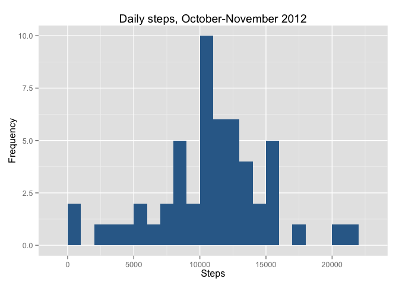
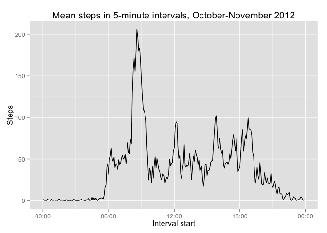
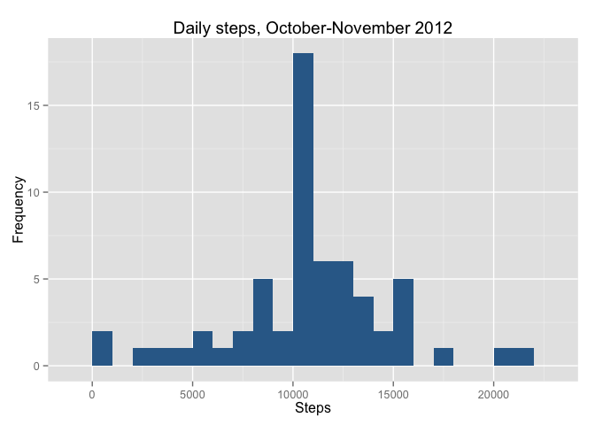
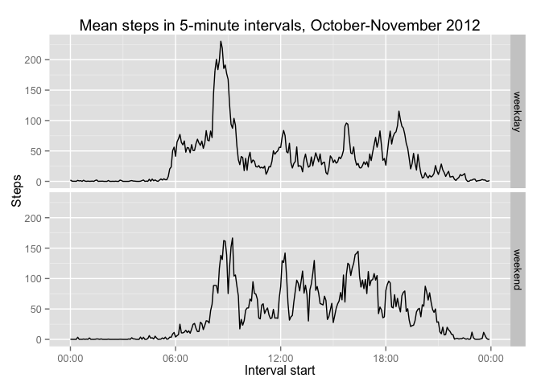

# Reproducible Research: Peer Assessment 1


## Loading and preprocessing the data
The data are stored as a csv with 3 variables. First convert the date from a string to a date, and convert
the time from an int (e.g. 935 for 9:35 AM) to a POSIXct time. The date will be today's date in this object,
so the interval variable should only be used for the time within the day.

```r
data <- read.csv("activity.csv")
data$date <- as.Date(data$date)
data$interval <- as.POSIXct(strptime(sprintf("%04d",data$interval),"%H%M"))
```
This is what the data look like:

```r
head(data)
```

```
##   steps       date            interval
## 1    NA 2012-10-01 2015-08-07 00:00:00
## 2    NA 2012-10-01 2015-08-07 00:05:00
## 3    NA 2012-10-01 2015-08-07 00:10:00
## 4    NA 2012-10-01 2015-08-07 00:15:00
## 5    NA 2012-10-01 2015-08-07 00:20:00
## 6    NA 2012-10-01 2015-08-07 00:25:00
```
(Steps are integers when they aren't missing.)

I'll use the ggplot2 and scales packages to plot figures later, so I'll load them here.

```r
require(ggplot2)
```

```
## Loading required package: ggplot2
```

```r
require(scales)
```

```
## Loading required package: scales
```

## What is mean total number of steps taken per day?
Create a new data frame with one row for each day, and columns for the date
and the total number of steps for that day.

```r
stepsbyday <- aggregate(data$steps, by=list(data$date), FUN=function(x){sum(x)})
names(stepsbyday) <- c("day", "totalsteps")
head(stepsbyday)
```

```
##          day totalsteps
## 1 2012-10-01         NA
## 2 2012-10-02        126
## 3 2012-10-03      11352
## 4 2012-10-04      12116
## 5 2012-10-05      13294
## 6 2012-10-06      15420
```

Plot a histogram of the total daily steps over the two-month period.

```r
qplot(x=totalsteps, data=stepsbyday, binwidth = 1000, fill = 0) +
    theme(legend.position="none") +
    labs(title="Daily steps, October-November 2012", x = "Steps", y = "Frequency")
```

 
  
Compute summary statistics for daily steps.

```r
median(stepsbyday$totalsteps, na.rm = T)
```

```
## [1] 10765
```

```r
mean(stepsbyday$totalsteps, na.rm = T)
```

```
## [1] 10766.19
```

## What is the average daily activity pattern?
Create a new data frame with one row for each 5-minute interval, and columns for the time
and the mean number of steps for that interval, ignoring missing values.

```r
stepsbytime <- aggregate(data$steps, by=list(data$interval), FUN=function(x){mean(x, na.rm = T)})
names(stepsbytime) <- c("interval", "meansteps")
head(stepsbytime)
```

```
##              interval meansteps
## 1 2015-08-07 00:00:00 1.7169811
## 2 2015-08-07 00:05:00 0.3396226
## 3 2015-08-07 00:10:00 0.1320755
## 4 2015-08-07 00:15:00 0.1509434
## 5 2015-08-07 00:20:00 0.0754717
## 6 2015-08-07 00:25:00 2.0943396
```

Plot the mean steps over time, measured in 5-minute intervals, averaged over all days.

```r
ggplot(data=stepsbytime, aes(x=interval, y=meansteps)) +
    geom_line() +
    scale_x_datetime(labels = date_format("%H:%M", tz = NULL)) +
    labs(title = "Mean steps in 5-minute intervals, October-November 2012", x = 
             "Interval start", y = "Steps")
```

 
  
Find the 5-minute interval with the highest mean number of steps. Only the time component of the output is meaningful;
ignore the date.

```r
stepsbytime$interval[stepsbytime$meansteps==max(stepsbytime$meansteps)]
```

```
## [1] "2015-08-07 08:35:00 PDT"
```
## Imputing missing values

First check how many missing values there are in the entire dataset:

```r
sum(is.na(data$steps))
```

```
## [1] 2304
```
It turns out that all days either have no missing values, or have all missing values: 

```r
table(aggregate(data$steps, by=list(data$date), FUN=function(x){sum(is.na(x)/length(x))})$x)
```

```
## 
##  0  1 
## 53  8
```

Impute the missing values by taking the mean value for that interval, across all other days where
data are available. Then, create a new data frame that has the imputed values.

```r
missing <- is.na(data$steps)
interval2mean <- function(x){stepsbytime$meansteps[stepsbytime$interval==x]}
imputedsteps <- sapply(data[missing,"interval"], interval2mean)
imputeddata = data.frame(steps = data$steps, date = data$date, interval = data$interval)
imputeddata$steps[missing] <- imputedsteps
head(imputeddata)
```

```
##       steps       date            interval
## 1 1.7169811 2012-10-01 2015-08-07 00:00:00
## 2 0.3396226 2012-10-01 2015-08-07 00:05:00
## 3 0.1320755 2012-10-01 2015-08-07 00:10:00
## 4 0.1509434 2012-10-01 2015-08-07 00:15:00
## 5 0.0754717 2012-10-01 2015-08-07 00:20:00
## 6 2.0943396 2012-10-01 2015-08-07 00:25:00
```

Repeat the analysis of the distribution of daily steps, but with imputed values:

```r
imputedstepsbyday <- aggregate(imputeddata$steps, by=list(imputeddata$date), FUN=function(x){sum(x)})
names(imputedstepsbyday) <- c("day", "totalsteps")
qplot(x=totalsteps, data=imputedstepsbyday, binwidth = 1000, fill = 0) +
    theme(legend.position="none") +
    labs(title="Daily steps, October-November 2012", x = "Steps", y = "Frequency")
```

 
  
Because the simple method of imputing doesn't capture the variability in real data, the result
is that all the imputed days have a number of steps equal to the mean.

Recalculating summary statistics with the imputed data:

```r
median(imputedstepsbyday$totalsteps, na.rm = T)
```

```
## [1] 10766.19
```

```r
mean(imputedstepsbyday$totalsteps, na.rm = T)
```

```
## [1] 10766.19
```
The mean is unchanged, but now the median is equal to the idealized average day that we used to impute values.

## Are there differences in activity patterns between weekdays and weekends?
Extend the data frame with the imputed data by adding a factor variable for whether the day is a 
weekday or a weekend. Then create a new data frame with one row for each combination of 
time interval and weekend/weekday status, and columns for interval, weekend, and mean steps per day.


```r
daynames = weekdays(imputeddata$date)
isweekend = daynames %in% c("Saturday", "Sunday")
weekend = factor(isweekend)
levels(weekend) <- c("weekday", "weekend")
imputeddata$weekend = weekend
imputedstepsbytimeday <- aggregate(steps~interval+weekend, data = imputeddata, FUN = mean)
head(imputedstepsbytimeday)
```

```
##              interval weekend      steps
## 1 2015-08-07 00:00:00 weekday 2.25115304
## 2 2015-08-07 00:05:00 weekday 0.44528302
## 3 2015-08-07 00:10:00 weekday 0.17316562
## 4 2015-08-07 00:15:00 weekday 0.19790356
## 5 2015-08-07 00:20:00 weekday 0.09895178
## 6 2015-08-07 00:25:00 weekday 1.59035639
```
Plot the mean steps over time for weekend and weekday days.  

Note that the imputed data really shouldn't be used to make this comparison because our
imputed data values are assumed to be independent of weekdays vs weekends, so any contrast
will be partially smoothed out. It would be more accurate to use only the observed data.

```r
ggplot(data=imputedstepsbytimeday, aes(x=interval, y=steps)) +
    geom_line() +
    scale_x_datetime(labels = date_format("%H:%M", tz = NULL)) +
    labs(title = "Mean steps in 5-minute intervals, October-November 2012", x = 
             "Interval start", y = "Steps") + 
    facet_grid(weekend ~ .)
```

 
  
On weekends, it looks like the test subject tends to start taking steps later in the morning
and continues taking steps slightly later into the evening than on weekends. He or she also
takes more steps in the afternoon on weekends, and has less of a spike around 8:00-9:00.
